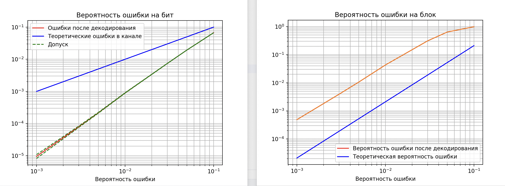

# Code Hemming (7,4)

Пример систематического кода Хемминга, в котором проверочные биты стоят за основными битами.
В отличие от классического кода Хемминга, где проверочные биты чередуются с информационными.

## Установка

Клонируйте репозиторий с GitHub. Затем создайте виртуальную среду и установите все зависимости.

```bash
git clone https://github.com/mikop63/code-hemming-7-4.git
cd code-hemming-7-4
python3 -m venv env
source env/bin/activate
python -m pip install -r requirements.txt
```

## Работа кода

На вход поступает информационный сигнал -> \
-> кодируется кодом Хемминга (7,4) -> \
-> передается по каналу передачи (появляются ошибки в случайных местах) -> \
-> декодируется кодом Хемминга и исправляются ошибки допущенные при передачи по каналу

## Принцип работы кода Хемминга (7,4)

Берется 4 бита информации (например `0110`)

К этим битаем добавляются еще 3:

```python
Бит[4] = Бит[0] ^ Бит[1] ^ Бит[2]
Бит[5] = Бит[1] ^ Бит[2] ^ Бит[3]
Бит[6] = Бит[0] ^ Бит[2] ^ Бит[3]
```

`^` - логическая операция "Исключающие ИЛИ"

```text
0 ^ 0 = 0
0 ^ 1 = 1
1 ^ 0 = 1
1 ^ 1 = 0 
```

В примере `0110` превратится в `0110001`

Передаем последовательность и на приеме рассчитываем синдромы. По результатам расчетов получаем синдром
который укажет на место ошибки

```python
syndrom[1] = Бит[4] ^ Бит[0] ^ Бит[1] ^ Бит[2]
syndrom[2] = Бит[5] ^ Бит[1] ^ Бит[2] ^ Бит[3]
syndrom[3] = Бит[6] ^ Бит[0] ^ Бит[2] ^ Бит[3]
```

Комбинация : место (начниная с 0)

```text
000: нет ошибки,
101: 0,
110: 1,
111: 2,
011: 3,
100: 4,
010: 5,
001: 6
```

Пример расчета места ошибки для комбинации `0100001`

```text
0 ^ 0 ^ 1 ^ 0
0 ^ 1 ^ 0 ^ 0
1 ^ 0 ^ 0 ^ 0
```

`111` соответствует месту 2

```text
0100001
  ^
  Ошибка
```

Комбинация до добавления ошибки: 0110001

## Как работает программа

При `length = 5000000`, 5 млн комбинаций по 4 байта каждая передаются по каналу,

Результат выполнения на MacBook M2:
```text
Количество битов 20000000
Теоретическая вероятность ошибки: [0.001, 0.003, 0.005, 0.01, 0.03, 0.05, 0.1]
Частость ошибки в канале: [34881, 105264, 174897, 349814, 1048585, 1750543, 3500218]
Частость ошибки после декодирования: [191, 1596, 4346, 17892, 148048, 388439, 1337452]
Реальная вероятность ошибки в канале: [34881, 105264, 174897, 349814, 1048585, 1750543, 3500218]
Вероятность ошибки после декодирования: [9.55e-06, 7.98e-05, 0.0002173, 0.0008946, 0.0074024, 0.01942195, 0.0668726]
Программа выполнялась за: 2 мин. 54 сек.
```

По полученным результатам строятся графики.

 

По результатам видно: чем больше ошибок, тем меньше этих ошибок начинает исправлять код Хемминга (7, 4) 